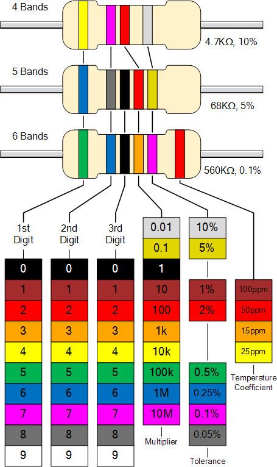

#Resistors

### Calculating Resitor Values

The Resistor Colour Code system is all well and good but we need to understand how to apply it in order to get the correct value of the resistor. The “left-hand” or the most significant coloured band is the band which is nearest to a connecting lead with the colour coded bands being read from left-to-right as follows;

<b>Digit, Digit, Multiplier = Colour, Colour x 10 colour  in Ohm’s (Ω’s)</b>

For example, a resistor has the following coloured markings;
Yellow Violet Red = 4 7 2 = 4 7 x 102 = 4700Ω or 4k7.

The fourth and fifth bands are used to determine the percentage tolerance of the resistor. Resistor tolerance is a measure of the resistors variation from the specified resistive value and is a consequence of the manufacturing process and is expressed as a percentage of its “nominal” or preferred value.

Typical resistor tolerances for film resistors range from 1% to 10% while carbon resistors have tolerances up to 20%. Resistors with tolerances lower than 2% are called precision resistors with the or lower tolerance resistors being more expensive.

Most five band resistors are precision resistors with tolerances of either 1% or 2% while most of the four band resistors have tolerances of 5%, 10% and 20%. The colour code used to denote the tolerance rating of a resistor is given as;

Brown = 1%, Red = 2%, Gold = 5%, Silver = 10 %

If resistor has no fourth tolerance band then the default tolerance would be at 20%.

